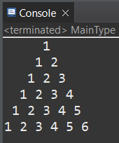
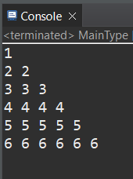
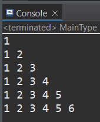
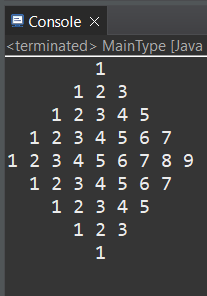
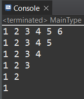
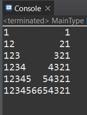
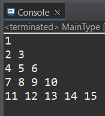
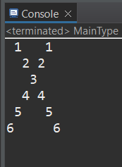
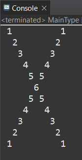

  * ### Program 1

* Link -> [Pattern number 1 program](https://github.com/smsatheesh/Basic_Coding_In_Java/blob/main/NumberPatterns/Program/Number1.java)

  * ### Program 2

  

* Link -> [Pattern number 2 program](https://github.com/smsatheesh/Basic_Coding_In_Java/blob/main/NumberPatterns/Program/Number2.java)

  * ### Program 3

  

* Link -> [Pattern number 3 program](https://github.com/smsatheesh/Basic_Coding_In_Java/blob/main/NumberPatterns/Program/Number3.java)

  * ### Program 4

  

* Link -> [Pattern number 4 program](https://github.com/smsatheesh/Basic_Coding_In_Java/blob/main/NumberPatterns/Program/Number4.java)

  * ### Program 5

  

* Link -> [Pattern number 5 program](https://github.com/smsatheesh/Basic_Coding_In_Java/blob/main/NumberPatterns/Program/Number5.java)

  * ### Program 6
  
  

* Link -> [Pattern number 6 program](https://github.com/smsatheesh/Basic_Coding_In_Java/blob/main/NumberPatterns/Program/Number6.java)

  * ### Program 7

  

* Link -> [Pattern number 7 program](https://github.com/smsatheesh/Basic_Coding_In_Java/blob/main/NumberPatterns/Program/Number7.java)

  * ### Program 8

  

* Link -> [Pattern number 8 program](https://github.com/smsatheesh/Basic_Coding_In_Java/blob/main/NumberPatterns/Program/Number8.java)

  * ### Program 9

  

* Link -> [Pattern number 9 program](https://github.com/smsatheesh/Basic_Coding_In_Java/blob/main/NumberPatterns/Program/Number9.java)

